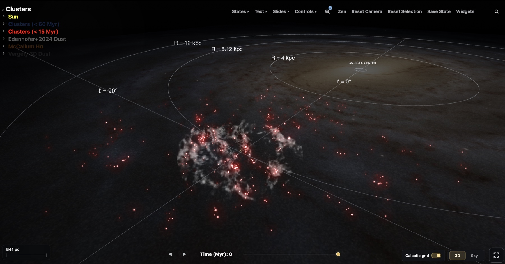
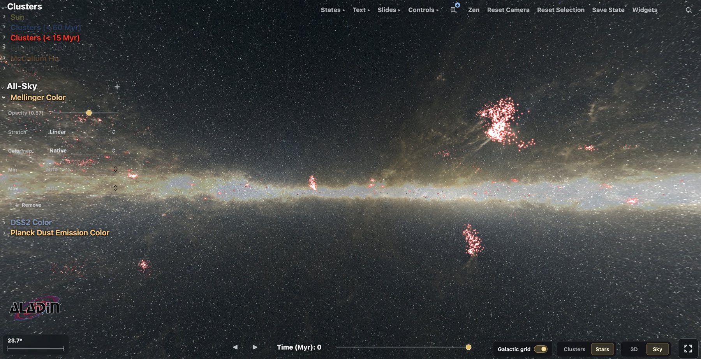

# Oviz

Oviz is a Python package for making interactive HTML figures from 3D stellar
data. It is built mainly for Gaia studies of young clusters and associations,
especially when their positions and motions need to be viewed alongside 3D
maps of the interstellar medium (ISM).

You describe the data and figure in Python. Oviz builds the browser viewer and
its controls, so authors do not need to write JavaScript. In the finished
figure, a reader can move through time, rotate the Galactic scene, switch to a
registered view of the sky, and inspect the data directly.

The viewer uses:

- [Three.js](https://threejs.org/) to draw the 3D scene
- [Aladin Lite](https://aladin.cds.unistra.fr/AladinLite/doc/) for registered
  all-sky HiPS images
- [galpy](https://docs.galpy.org/en/latest/) to integrate Galactic orbits
- Astropy, NumPy, and pandas for coordinates and tables

## Example figure

**[Open the interactive young-cluster figure](https://cswigg.github.io/cam_website/oviz_figures/main_figure_july25.html).**
It combines young clusters, member stars, 3D dust, ionized gas, and several
views of the Milky Way. The same figure can be explored in Galactic 3D or
projected onto the sky.

[](https://cswigg.github.io/cam_website/oviz_figures/main_figure_july25.html)

*Galactic 3D view with young clusters, the Edenhofer dust map, the McCallum
H-alpha map, and a face-on Milky Way image.*

[](https://cswigg.github.io/cam_website/oviz_figures/main_figure_july25.html)

*Sky view with cluster members and all-sky imagery registered through Aladin
Lite.*

Data and image credits for this example:

- Star clusters: [Hunt and Reffert (2023)](https://doi.org/10.1051/0004-6361/202346285),
  based on Gaia DR3.
- Sco-Cen groups and member stars: [Ratzenböck et al. (2023)](https://doi.org/10.1051/0004-6361/202243690),
  with ages from their [Sco-Cen star-formation history](https://doi.org/10.1051/0004-6361/202346901).
- 3D dust: [Edenhofer et al. (2024)](https://doi.org/10.1051/0004-6361/202347628)
  and [Vergely, Lallement, and Cox (2022)](https://doi.org/10.1051/0004-6361/202243319).
- 3D H-alpha emission: [McCallum et al. (2025)](https://doi.org/10.1093/mnrasl/slaf023).
- Face-on Milky Way image: [ESA/Gaia/DPAC, Stefan Payne-Wardenaar](https://www.esa.int/ESA_Multimedia/Images/2023/12/Top-down_view_of_the_Milky_Way),
  available under CC BY-SA 3.0 IGO or the ESA Standard Licence.
- Sky imagery: the [Mellinger color panorama](https://doi.org/10.1086/648480)
  and [Planck HFI color survey](https://alasky.cds.unistra.fr/MocServer/query?ID=CDS%2FP%2FPLANCK%2FR2%2FHFI%2Fcolor&fmt=html&get=record),
  served through Aladin Lite.

## What Oviz is for

Oviz can follow clusters through space and time, show their member stars on the
sky, and compare them with dust or emission maps. It currently works with data
products such as:

- [Gaia Data Release 3](https://doi.org/10.1051/0004-6361/202243940)
- the [Gaia DR3 all-sky open-cluster catalogue](https://doi.org/10.1051/0004-6361/202346285)
- the [SigMA view of the Sco-Cen association](https://doi.org/10.1051/0004-6361/202243690)
- the [Edenhofer et al. parsec-scale 3D dust map](https://doi.org/10.1051/0004-6361/202347628)
- the [Vergely et al. Gaia-2MASS 3D dust maps](https://cdsarc.cds.unistra.fr/viz-bin/ReadMe/J/A%2BA/664/A174?format=html&tex=true)

The same data model can hold other point, line, image, and volume layers.
Support for more astronomical views and analysis tools is planned.

Oviz is being developed with
[Gaia Data Release 4](https://www.esa.int/Science_Exploration/Space_Science/Gaia/%28archive%29)
in mind. DR4 is currently expected in December 2026. Oviz provides a way to
explore Gaia data in 3D and over time, then share a particular view or sequence
without asking the reader to reproduce the analysis.

## Install

```bash
python -m pip install -e .
```

Oviz requires Python 3.8 or newer. Its core Python dependencies are NumPy,
pandas, Astropy, and galpy.

## Minimal example

A time-varying `Trace` needs Galactic Cartesian positions in parsecs,
velocities in km/s, a name, and an age:

```python
import numpy as np
import pandas as pd

from oviz import Animate3D, Trace, TraceCollection

clusters = pd.DataFrame(
    {
        "x": [35.0, -80.0],
        "y": [120.0, 60.0],
        "z": [15.0, -25.0],
        "U": [-11.0, -9.5],
        "V": [-18.0, -21.0],
        "W": [-7.0, -5.0],
        "name": ["Cluster A", "Cluster B"],
        "age_myr": [12.0, 28.0],
        "n_stars": [180, 75],
    }
)

trace = Trace(
    clusters,
    data_name="Young clusters",
    color="#e34a4a",
    size_by_n_stars=True,
)
scene = Animate3D(
    TraceCollection([trace]),
    xyz_widths=(2000, 2000, 600),
    figure_theme="dark",
)

figure = scene.make_plot(
    time=np.arange(-30.0, 0.5, 0.5),
    galactic_mode=True,
    enable_sky_panel=True,
    renderer="threejs",
    show=False,
    compress_scene_spec=True,
)
figure.write_html("young_clusters.html")
```

For a static XYZ catalogue, use `Layer(..., assume_stationary=True)`. You can
also pass volume layers and optional cluster-member catalogues to
`Animate3D.make_plot()`. The [Python API](docs/source/python_api.rst) lists the
available arguments.

## Save and share views with States

A State records the complete viewer at one moment. This includes the camera,
time, 3D or Sky mode, trace and volume settings, Aladin layers, selections,
panels, and presentation settings.

Open the States panel in the viewer and save the views you want to show. You
can reorder them, move between them, and export the result as either an
editable figure or a present-only figure with forward and back controls.

The export is a single HTML file containing the scientific scene and its saved
States. It can be opened locally, placed on a static web host, or sent to a
collaborator. The recipient does not need Python or a copy of the original
analysis.

Three.js and Aladin Lite load from public CDNs. HiPS backgrounds come from
their survey servers. Those parts of the viewer need an internet connection.

## Data conventions

- Positions `x`, `y`, and `z` are in parsecs and use Galactic Cartesian
  coordinates.
- Velocities `U`, `V`, and `W` are in km/s.
- `age_myr` is in Myr.
- `n_stars` is optional unless the figure uses it to scale point sizes.
- Every time array must include `t = 0`.
- A member-star table must have a cluster-name column and either Galactic
  (`l`, `b`) or ICRS (`ra`, `dec`) sky coordinates.

## Documentation and tests

- [Overview](docs/source/overview.rst)
- [Python API](docs/source/python_api.rst)
- [Browser API](docs/source/browser_api.rst), for maintainers and hosts
- [Guide for coding agents](AGENTS.md)

Most figure authors only need the Python API.

Run the maintained test suite with:

```bash
pytest -q tests
```
