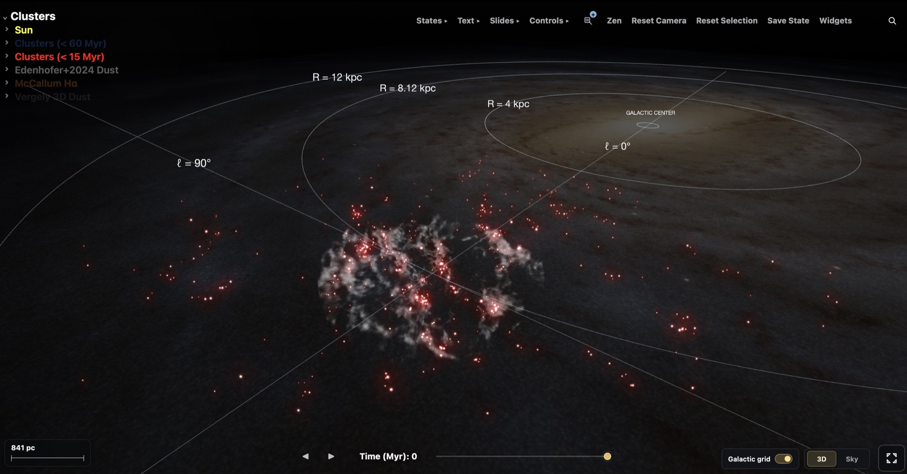
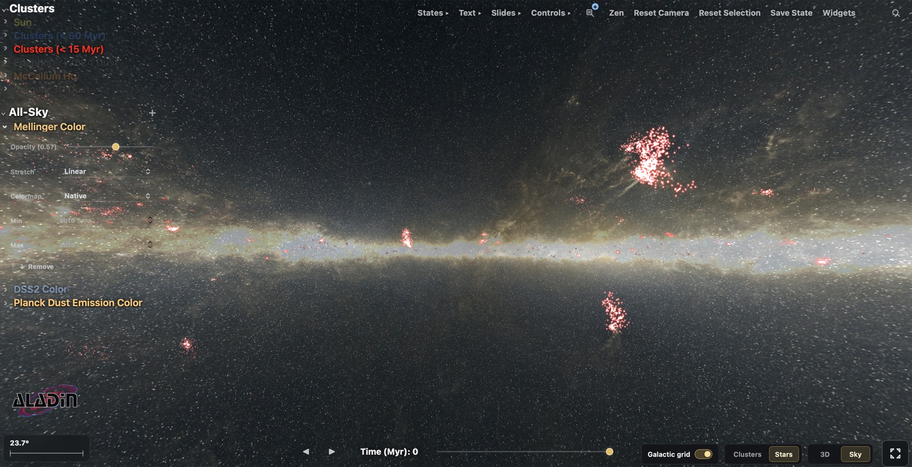

# Oviz

Oviz is a Python package for making interactive HTML figures from 3D stellar
data. It is built mainly for Gaia studies of young clusters and associations,
especially when their positions and motions need to be viewed alongside 3D
maps of the interstellar medium (ISM).

You describe the data and figure in Python. Oviz builds the browser viewer and
its controls, so authors do not need to write JavaScript. In the finished
figure, a reader can move through time, rotate the Galactic scene, switch to a
registered view of the sky, and inspect the data directly.

The viewer uses:

- a purpose-built WebGL2 engine (no runtime dependencies) to draw the 3D
  scene, interpolating every orbit on the GPU
- [Aladin Lite](https://aladin.cds.unistra.fr/AladinLite/doc/) for registered
  all-sky HiPS images
- [galpy](https://docs.galpy.org/en/latest/) to integrate Galactic orbits
- Astropy, NumPy, and pandas for coordinates and tables

### The viewer at a glance

- **Fast.** Figures store compact binary data rather than JSON. The July 25
  example shrinks from 48 MB to 24 MB, draws its first frame in about 70 ms,
  and has its 3D dust resident in about 0.2 s. Scrubbing time costs no CPU
  work, and an idle figure costs nothing.
- **Smooth time.** Cluster positions are interpolated between the stored
  frames, so playback and scrubbing are continuous at any speed.
- **Find anything.** Press ⌘K to search every cluster (including catalogue
  aliases), layer, saved view and action.
- **Inspect.** Click an object for its age today and at time *t*, member count,
  distance, and Galactic and ICRS coordinates. Follow it through time, draw its
  orbit trail, or Shift-click a second object to measure separations.
- **Distribution filter.** A live histogram of age, members, distance or height
  for the visible layers. Brush a range to dim or hide everything else.
- **Sky view.** The scene is registered exactly to Aladin Lite, and cluster
  markers crossfade into their member stars.
- **Views & story.** Save views with thumbnails and captions. Present them with
  smooth transitions that end in an exact restore, and export an editable or
  present-only file.
- **Capture.** Save PNGs at up to 4× resolution, or record MP4/WebM videos of
  the timeline or a story tour. Share a link that reopens the current view.
- **Everywhere.** Light and dark interface themes, and a thumb-friendly phone
  layout.

## Example figure

**[Open the interactive young-cluster figure](https://cswigg.github.io/cam_website/oviz_figures/main_figure_july25.html).**
It combines young clusters, member stars, 3D dust, ionized gas, and several
views of the Milky Way. The same figure can be explored in Galactic 3D or
projected onto the sky.

[](https://cswigg.github.io/cam_website/oviz_figures/main_figure_july25.html)

*Galactic 3D view with young clusters, the Edenhofer dust map, the McCallum
H-alpha map, and a face-on Milky Way image.*

[](https://cswigg.github.io/cam_website/oviz_figures/main_figure_july25.html)

*Sky view with cluster members and all-sky imagery registered through Aladin
Lite.*

Data and image credits for this example:

- Star clusters: [Hunt and Reffert (2023)](https://doi.org/10.1051/0004-6361/202346285),
  based on Gaia DR3.
- Sco-Cen groups and member stars: [Ratzenböck et al. (2023)](https://doi.org/10.1051/0004-6361/202243690),
  with ages from their [Sco-Cen star-formation history](https://doi.org/10.1051/0004-6361/202346901).
- 3D dust: [Edenhofer et al. (2024)](https://doi.org/10.1051/0004-6361/202347628)
  and [Vergely, Lallement, and Cox (2022)](https://doi.org/10.1051/0004-6361/202243319).
- 3D H-alpha emission: [McCallum et al. (2025)](https://doi.org/10.1093/mnrasl/slaf023).
- Face-on Milky Way image: [ESA/Gaia/DPAC, Stefan Payne-Wardenaar](https://www.esa.int/ESA_Multimedia/Images/2023/12/Top-down_view_of_the_Milky_Way),
  available under CC BY-SA 3.0 IGO or the ESA Standard Licence.
- Sky imagery: the [Mellinger color panorama](https://doi.org/10.1086/648480)
  and [Planck HFI color survey](https://alasky.cds.unistra.fr/MocServer/query?ID=CDS%2FP%2FPLANCK%2FR2%2FHFI%2Fcolor&fmt=html&get=record),
  served through Aladin Lite.

## What Oviz is for

Oviz is for astronomical data with a position, motion, or extent in the
Galaxy. A scene can mix point catalogues, orbit tracks, labels, images, and 3D
volumes. Time-dependent data can move through their calculated histories while
stationary catalogues remain fixed in the same coordinate system.

The same scene can be viewed from outside the Galaxy or projected onto the sky
as seen from Earth. Researchers can examine the spatial relationships between
stars, clusters, gas, dust, and other Galactic structures directly instead of
comparing a series of static panels.

Development currently focuses on Gaia astrometry, young stellar populations,
and 3D maps of the interstellar medium. The viewer itself is not tied to a
particular catalogue or map. Support for more astronomical views and analysis
tools is planned.

Oviz is being developed with
[Gaia Data Release 4](https://www.esa.int/Science_Exploration/Space_Science/Gaia/%28archive%29)
in mind. DR4 is currently expected in December 2026. Oviz provides a way to
explore Gaia data in 3D and over time, then share a particular view or sequence
without asking the reader to reproduce the analysis.

## Install

```bash
python -m pip install -e .
```

Oviz requires Python 3.8 or newer. Its core Python dependencies are NumPy,
pandas, Astropy, and galpy.

## Minimal example

A time-varying `Trace` needs Galactic Cartesian positions in parsecs,
velocities in km/s, a name, and an age:

```python
import numpy as np
import pandas as pd

from oviz import Animate3D, Trace, TraceCollection

clusters = pd.DataFrame(
    {
        "x": [35.0, -80.0],
        "y": [120.0, 60.0],
        "z": [15.0, -25.0],
        "U": [-11.0, -9.5],
        "V": [-18.0, -21.0],
        "W": [-7.0, -5.0],
        "name": ["Cluster A", "Cluster B"],
        "age_myr": [12.0, 28.0],
        "n_stars": [180, 75],
    }
)

trace = Trace(
    clusters,
    data_name="Young clusters",
    color="#e34a4a",
    size_by_n_stars=True,
)
scene = Animate3D(
    TraceCollection([trace]),
    xyz_widths=(2000, 2000, 600),
    figure_theme="dark",
)

figure = scene.make_plot(
    time=np.arange(-30.0, 0.5, 0.5),
    galactic_mode=True,
    enable_sky_panel=True,
    renderer="threejs",
    show=False,
    compress_scene_spec=True,
)
figure.write_html("young_clusters.html")
```

`make_plot` writes the Oviz viewer by default. Pass `viewer="classic"` for
the previous Three.js runtime, which also provides Slides, Paper, and AR
exports.

For a static XYZ catalogue, use `Layer(..., assume_stationary=True)`. You can
also pass volume layers and optional cluster-member catalogues to
`Animate3D.make_plot()`. The [Python API](docs/source/python_api.rst) lists the
available arguments.

## Save and share views with States

A State (a *view* in the viewer's story panel) records the complete viewer at
one moment. That covers the camera, time, 3D or Sky mode, trace and volume
settings, Aladin layers, filters, and display settings.

Press **N** to save a view and **Y** to open the story. There you can rename,
caption, and reorder views, and present them in order with **P**. Export
the result as an editable figure (**⌘S**) or as a present-only figure that
opens straight into the first view. Press **?** in any figure for the full
keyboard map; the classic keys (W A S D, Q E, R F, L, C, P, [ ]) work as
before, and **J** adds GPU motion trails during playback.

The export is a single HTML file containing the scientific scene and its saved
States. It can be opened locally, placed on a static web host, or sent to a
collaborator. The recipient does not need Python or a copy of the original
analysis.

The 3D scene needs no network connection. Aladin Lite loads from the CDS CDN,
and HiPS backgrounds stream from their survey servers, so Sky view needs an
internet connection.

## Upgrade existing figures

Figures written by earlier Oviz releases carry their full scene, so they can be
moved to the new viewer without re-running the analysis. Their saved States are
migrated too:

```bash
python -m oviz.viewer.upgrade old_figure.html new_figure.html
```

## Data conventions

- Positions `x`, `y`, and `z` are in parsecs and use Galactic Cartesian
  coordinates.
- Velocities `U`, `V`, and `W` are in km/s.
- `age_myr` is in Myr.
- `n_stars` is optional unless the figure uses it to scale point sizes.
- Every time array must include `t = 0`.
- A member-star table must have a cluster-name column and either Galactic
  (`l`, `b`) or ICRS (`ra`, `dec`) sky coordinates.

## Documentation and tests

- [Overview](docs/source/overview.rst)
- [Python API](docs/source/python_api.rst)
- [The Oviz viewer](docs/source/viewer.rst): using figures, the browser API,
  and how the engine works
- [Classic browser API](docs/source/browser_api.rst), for figures written with
  `viewer="classic"`
- [Guide for coding agents](AGENTS.md)

Most figure authors only need the Python API.

Run the maintained test suite with:

```bash
pytest -q tests
```

The viewer's JavaScript unit tests run with Node (they are also invoked from
`tests/test_viewer.py`):

```bash
node --test tests/viewer_js/*.test.mjs
```
