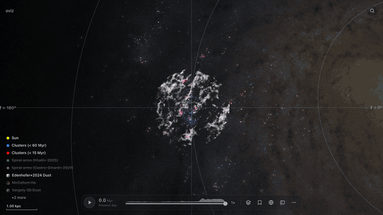

# Oviz

**Interactive 3D figures of the Milky Way's young stars, from Python to one HTML file.**



Oviz turns tables of clusters or stars (positions, velocities, ages) into a
figure anyone can open in a browser. Orbits are integrated with
[galpy](https://docs.galpy.org) and replayed on the GPU, 3D dust and emission
maps render as volumes, the sky view is registered to
[Aladin Lite](https://aladin.cds.unistra.fr/AladinLite/), and saved views play
as a presentation.

**[Open the live example](https://cswigg.github.io/cam_website/oviz_figures/oviz_oct1.html)** ·
[Documentation](docs/source/overview.rst) · [Skill for AI agents](SKILL.md)

## Install

```bash
pip install git+https://github.com/CSwigg/oviz.git
```

## Make a figure

```python
import numpy as np
import pandas as pd
from oviz import Scene3D, Trace, TraceCollection

clusters = pd.read_csv("clusters.csv")  # x, y, z [pc]; U, V, W [km/s]; name; age_myr
scene = Scene3D(TraceCollection([Trace(clusters, data_name="Young clusters", color="#ff5a5a")]),
                figure_theme="dark")
figure = scene.make_plot(time=np.arange(0, -61, -1.0), galactic_mode=True, enable_sky_panel=True)
figure.write_html("clusters.html")
```

Positions are heliocentric Galactic Cartesian (x towards the Galactic centre)
and the time grid must include 0; negative times are the past. From there you
can add 3D volumes (`volumes=`), member stars for the sky view
(`cluster_members_file=`), a spiral-arm potential and published arms
(`oviz.spiral_models`), or upgrade an older figure with
`python -m oviz.viewer.upgrade old.html new.html`.

## In the figure

- Play or scrub time; every orbit is interpolated on the GPU.
- Orbit the scene in 3D, or switch to the sky with member stars and HiPS surveys.
- Click to inspect, lasso to select, ⌘K to search, and share links that reopen a view.
- Save views and present them; export PNG, video or AR; works on phones.

## Develop

```bash
pip install -e .
pytest -q tests
node --test tests/viewer_js/*.test.mjs
```

[AGENTS.md](AGENTS.md) describes the architecture and the rules the viewer
keeps.

<details>
<summary>Data in the example figure</summary>

- Star clusters: [Hunt & Reffert (2023)](https://doi.org/10.1051/0004-6361/202346285), Gaia DR3.
- Sco-Cen groups and members: [Ratzenböck et al. (2023)](https://doi.org/10.1051/0004-6361/202243690).
- 3D dust: [Edenhofer et al. (2024)](https://doi.org/10.1051/0004-6361/202347628) and
  [Vergely et al. (2022)](https://doi.org/10.1051/0004-6361/202243319); 3D Hα:
  [McCallum et al. (2025)](https://doi.org/10.1093/mnrasl/slaf023).
- Spiral arms and potential: [Khalil et al. (2025)](https://doi.org/10.1051/0004-6361/202453077) and
  [Castro-Ginard et al. (2021)](https://doi.org/10.1051/0004-6361/202039751); pulsars:
  [ATNF catalogue](https://www.atnf.csiro.au/research/pulsar/psrcat/) (Manchester et al. 2005).
- Face-on Milky Way: [ESA/Gaia/DPAC, S. Payne-Wardenaar](https://www.esa.int/ESA_Multimedia/Images/2023/12/Top-down_view_of_the_Milky_Way)
  (CC BY-SA 3.0 IGO); sky surveys through Aladin Lite (CDS).

</details>

MIT License.
